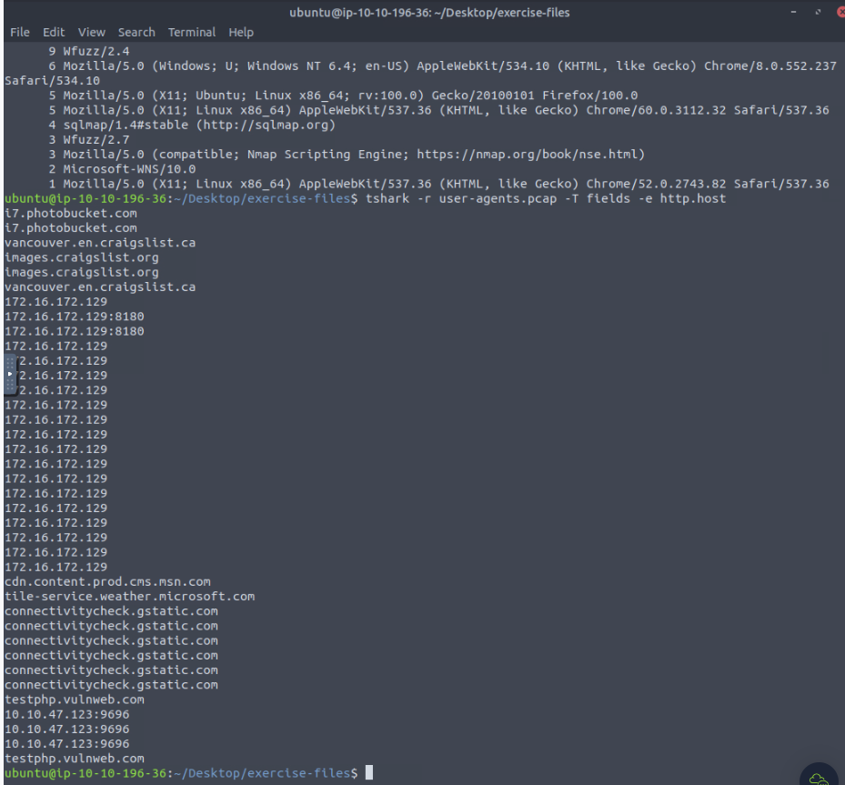

CLI Command Lines

These options are applied to all packets in scope unless a display filter is provided.
Most of the commands shown below are CLI versions of the Wireshark features discussed in Wireshark: Packet Operations (Task 2).
TShark explains the parameters used at the beginning of the output line.
For example, you will use the phs option to view the protocol hierarchy. Once you use this command, the result will start with the "Packet Hierarchy Statistics" header.

Parameter	                Purpose

--color              Wireshark-like colourised output.
                     tshark --color
-z	
                    Statistics
                    There are multiple options available under this parameter. You can view the available filters under this parameter with:
                        tshark -z help
                    Sample usage.
                        tshark -z filter
                    Each time you filter the statistics, packets are shown first, then the statistics provided. You can suppress packets and focus on the statistics by using the -q parameter.

Colourised Output
               tshark -r colour.pcap --color 

Protocol Hierarchy Statistics
                    user@ubuntu$ tshark -r demo.pcapng -z io,phs -q
          #the protocols used, frame numbers, and size of packets in a tree view based on packet numbers

        #udp keyword to the filter to focus on the UDP protocol
              tshark -r demo.pcapng -z io,phs,udp -q 

analysts to detect anomalously big and small packets at a glance! Use the -z plen,tree 
-q parameters to view the packet lengths tree. View packet lengths tree
            tshark -r demo.pcapng -z plen,tree -q

 Use the -z endpoints,ip -q parameters to view IP endpoints. Note that you can choose other available protocols as well.

Filter	                Purpose
eth                 Ethernet addresses
ip                  IPv4 addresses
ipv6                IPv6 addresses
tcp                 TCP addresses
                    Valid for both IPv4 and IPv6
udp                 UDP addresses
                    Valid for both IPv4 and IPv6
wlan                IEEE 802.11 addresses

            tshark -r demo.pcapng -z endpoints,ip -q

Statistics | Expert Info

The expert info view helps analysts to view the automatic comments provided by Wireshark. If you are unfamiliar with the "Wireshark Expert Info", visit task 4 in the Wireshark: The Basics room of the Wireshark module. Use the -z expert -q parameters to view the expert information.
            tshark -r demo.pcapng -z expert -q

            Advanced Filtering Options | Contains, Matches and Extract Fields

Accomplishing in-depth packet analysis sometimes ends up with a special filtering requirement that cannot be covered with default filters. TShark supports Wireshark's "contains" and "matches" operators, which are the key to the advanced filtering options. You can visit the Wireshark: Packet Operations room (Task 6) if you are unfamiliar with these filters. 

A quick recap from the Wireshark: Packet Operations room:

Filter	                    Details
Contains            Search a value inside packets.
                    Case sensitive.
                    Similar to Wireshark's "find" option.

Matches	            Search a pattern inside packets.
                    Supports regex.
                    Case insensitive.
                    Complex queries have a margin of error.

Note: The "contains" and "matches" operators cannot be used with fields consisting of "integer" values.
Tip: Using HEX and regex values instead of ASCII always has a better chance of a match.

                    Extract Fields

This option helps analysts to extract specific parts of data from the packets. In this way, analysts have the opportunity to collect and correlate various fields from the packets. It also helps analysts manage the query output on the terminal. The query structure is explained in the table given below.

Main Filter	        Target Field	        Show Field Name
-T fields	        -e <field name>	                -E header=y

Note: You need to use the -e parameter for each field you want to display.

You can filter any field by using the field names as shown below.

 tshark -r demo.pcapng -T fields -e ip.src -e ip.dst -E header=y -c 5 

                    Filter: "contains"

Filter              contains

Type	            Comparison operator
Description	        Search a value inside packets. It is case-sensitive and provides similar 
                    functionality to the  "Find" option by focusing on a specific field.Example	Find all "Apache" servers.
Workflow	        List all HTTP packets where the "server" field contains the "<identifier to search>" keyword.
Usage               http.server contains "Apache"

                tshark -r demo.pcapng -Y 'http.server contains "Apache"'

                    Filter: "matches"

Filter                  Matches

Type	                Comparison operator
Description	            Search a pattern of a regular expression. It is case-insensitive, 
                        and complex queries have a margin of error.
Example	                Find all .php and .html pages.
Workflow	            List all HTTP packets where the "request method" field 
                        matches the keywords "GET" or "POST".
Usage                   http.request.method matches "(GET|POST)"

tshark -r demo.pcapng -Y 'http.request.method matches "(GET|POST)"' -T fields -e frame.time

                                Use Cases | Extract Information 

Query	                                        Purpose
tshark -r hostnames.pcapng -T fields -e         Main query.
dhcp.option.hostname                            Extract the DHCP hostname value.
                                    
awk NF                                          Remove empty lines.

sort -r                                         Sort recursively before handling the values.

uniq -c                                         Show unique values, but calculate 
                                                and show the number of  occurrences.

sort -r                                         The final sort process.
                                                Show the output/results from high occurrences to less.

What is the total number of the detected "Wfuzz user agents"
tshark -r hostnames.pcapng -T fields -e dhcp.option.hostname | awk NF | sort -r | uniq -c | sort -r | wc -l | grep <name>

tshark -r user-agents.pcap -T fields -e http.host

tshark -r teamwork.pcap -Y http.request -T fields -e http.host -e ip.dst -e http.request.full_uri

tshark -r teamwork.pcap -Y "http.request.method == POST" -T fields -e http.host -e http.request.uri -e text|  grep -oE '\b[A-Za-z0-9.%+-]+@[A-Za-z0-9.-]+.[A-Z\a-z]{2,}\b'